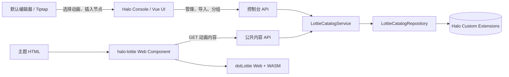
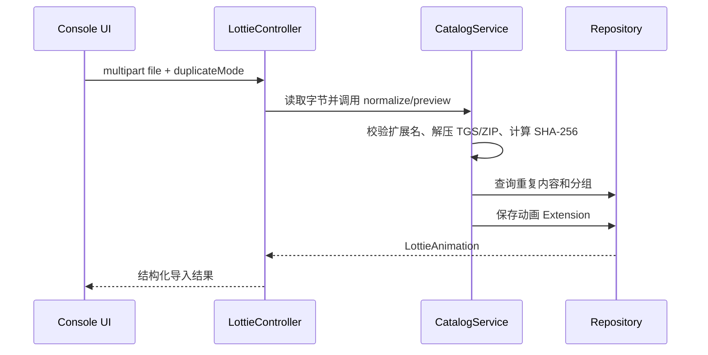

# Halo Lottie 插件架构

本文档描述 Halo Lottie 插件的边界、模块职责、数据流和扩展约束。文档以 Halo 2.26、Java 21、Spring WebFlux、Vue 3 和 `@lottiefiles/dotlottie-web` 为基线，并区分“当前实现”和“后续演进”，避免把规划中的功能误认为已经可用。

## 1. 目标与边界

插件的目标是让文章编辑器和主题直接渲染 Lottie 动画，而不是保存或展示短代码。动画以 `<halo-lottie>` 自定义元素保存到文章 HTML 中，浏览器运行时再通过公共 API 获取内容并交给 dotLottie 播放器。

支持的输入格式：

- Lottie JSON（`.json`）；
- dotLottie 包（`.lottie`）；
- Telegram Sticker 的 TGS（`.tgs`，导入时 gzip 解压并校验为 JSON）；
- ZIP 批量导入，按目录推断分组。

通过插件管理页面导入都会转为 dotLottie 格式存入附件库。

插件不负责制作动画、转换任意视频格式，也不把动画内容写入文章正文。文章只保存动画资源名、公共内容地址和插入时的显示配置。

## 2. 总体架构



后端使用端口隔离：Controller 只负责 HTTP 协议和参数绑定，业务规则集中在 `LottieCatalogService`，元数据存储通过 `LottieCatalogRepository` 抽象，二进制由 Halo `AttachmentService` 管理。当前仓储实现是 `HaloExtensionLottieCatalogRepository`，后续可替换为对象存储或缓存实现而不改变 Controller 和前端契约。

## 3. 代码模块与职责

| 模块 | 位置 | 职责 |
| --- | --- | --- |
| 插件生命周期 | `src/main/java/cn/ncii/lottie/LottiePlugin.java` | 注册和注销 `LottieGroup`、`LottieAnimation` Scheme。 |
| 领域资源 | `extension/LottieAnimation.java`、`LottieGroup.java` | 描述动画和分组的持久化结构，不依赖 HTTP。 |
| 播放配置 | `extension/LottieConfig.java` | 聚合尺寸、播放和无障碍默认值，供库管理、编辑器和运行时复用。 |
| 仓储端口 | `service/LottieCatalogRepository.java` | 定义响应式查询、保存、删除边界。 |
| Halo 仓储适配器 | `service/HaloExtensionLottieCatalogRepository.java` | 将仓储端口映射到 `ReactiveExtensionClient`。 |
| 应用服务 | `service/LottieCatalogService.java` | 命名、规范化、分组推断、哈希去重、导入编排和库操作。 |
| 控制台 API | `web/LottieController.java` | 管理员使用的列表、保存、删除、分组和导入接口。 |
| 公共 API | `web/LottiePublicController.java` | 只返回启用动画的内容，并设置正确 MIME 类型。 |
| 主题 head 扩展 | `web/LottieHeadProcessor.java` | 向启用主题注入 `lottie-runtime.js`。 |
| 管理 UI | `ui/src/views/LottieLibraryView.vue`、`ui/src/components/library/*` | 页面状态编排；分组侧栏、动画卡片、分组对话框和动画对话框分别负责展示与编辑。 |
| 播放预览 | `ui/src/components/LottieCanvas.vue` | 管理 DotLottie 实例的创建、错误显示和销毁。 |
| 编辑器节点 | `ui/src/editor/LottieExtension.ts` | 声明 Tiptap inline atom 节点及 HTML 序列化。 |
| 运行时组件 | `src/main/resources/static/lottie-runtime.js`、`ui/src/runtime/lottie-element.ts` | 将 `<halo-lottie>` 映射到 canvas 和 DotLottie 实例。 |

## 4. 领域模型

### 4.1 `LottieGroup`

Halo Extension GVK 为 `lottie.halo.run/v1alpha1, LottieGroup`。

`spec` 字段：

- `displayName`：管理界面和选择器展示名称；
- `parentName`：预留层级分组；
- `description`：分组说明；
- `sort`：排序值。

### 4.2 `LottieAnimation`

Halo Extension GVK 为 `lottie.halo.run/v1alpha1, LottieAnimation`。

`spec` 字段：

- `displayName`：可编辑的单动画名称；
- `groupName`：所属 `LottieGroup` 的资源名；
- `sort`：分组内排序值，从 0 开始；
- `format`：规范化后的 `json` 或 `lottie`；
- `mediaType`：内容 MIME 类型；
- `attachmentName` / `attachmentUrl`：Halo 附件名称和可访问 URL；导入内容不持久化到 Extension；
- `sha256`：规范化内容的 SHA-256，用于去重；
- `defaults`：`LottieConfig` 聚合默认值；
- `enabled`：是否允许公共 API 读取；
- `sourceFileName`：导入时的原始文件名。

资源名是内部稳定标识，展示名称可以随时修改。服务层会把输入转换为小写、短横线分隔的资源名，并限制在 Halo/Kubernetes 资源名允许的长度内。

### 4.3 `LottieConfig`

| 字段 | 默认值 | 含义 |
| --- | --- | --- |
| `width` / `height` | `160` | 插入实例的像素尺寸。 |
| `autoplay` | `true` | 创建播放器后是否自动播放。 |
| `loop` | `true` | 是否循环。 |
| `speed` | `1.0` | 播放速度。 |
| `fit` | `contain` | 画布内适配策略。 |
| `align` | `center` | 画布对齐位置。 |
| `controls` | `false` | 是否显示播放控件。 |
| `hoverPlay` | `false` | 悬停时播放。 |
| `freezeOnOffscreen` | `true` | 离开视口时暂停渲染。 |
| `ariaLabel` | 空 | 画布的无障碍标签。 |

配置有三层语义：插件设置提供全局上限和开关，动画 `defaults` 提供库级默认值，文章节点属性提供单次插入覆盖值。节点属性优先级最高，未设置时回退到动画默认值。

## 5. 导入与规范化流程



规范化规则：

1. JSON 必须是首尾为 `{`、`}` 的 UTF-8 文本；保存格式为 `json`。
2. TGS 使用 gzip 解压，解压结果按 JSON 校验，最终以 `application/json` 保存。
3. `.lottie` 保留二进制内容，以 `data:application/octet-stream;base64,...` 保存，播放时由 dotLottie 读取。
4. ZIP 只处理其中的 JSON、Lottie 和 TGS 文件；目录名映射到 `groupName`，文件名去除扩展名后作为初始 `displayName`。
5. 重复策略由 `duplicateMode` 控制：`skip` 跳过，`duplicate` 生成唯一资源名，其他策略应在服务层集中扩展。

当前安全限制为：压缩包最大 50 MB、解压及规范化内容最大 200 MB、最多 100 个文件。读取使用受限流，避免 ZIP 炸弹无限占用内存；上传阶段通过 Halo AttachmentService 写入附件库。

## 6. HTTP API 契约

控制台 API 使用 `console.api.lottie.halo.run/v1alpha1`，需要 Halo Console 的登录态和 `plugin:lottie:manage` 权限。

| 方法 | 路径 | 用途 |
| --- | --- | --- |
| `GET` | `/animations?group=` | 列出动画，可按分组过滤。 |
| `GET` | `/animations/{name}` | 获取单个动画的管理数据。 |
| `POST` | `/animations` | 保存或更新动画及默认配置。 |
| `DELETE` | `/animations/{name}` | 幂等删除动画。 |
| `GET` | `/groups` | 列出分组。 |
| `POST` | `/groups` | 保存或更新分组。 |
| `POST` | `/import/preview` | 预览 ZIP 中可导入的候选项。 |
| `POST` | `/import` | 导入单文件或 ZIP。 |
| `POST` | `/animations/bulk-delete` | 批量删除动画及其附件。 |
| `POST` | `/animations/bulk-move` | 批量移动动画到指定分组或未分组。 |
| `POST` | `/animations/reorder` | 保存指定分组内动画的完整顺序。 |

公共 API 使用 `api.lottie.halo.run/v1alpha1`：

`GET /animations/{name}/content` 只允许在动画 `enabled=true` 时访问；接口将请求重定向到 Halo 附件永久 URL，并附带长期缓存策略。附件自身返回 JSON 或 `application/octet-stream` 的 MIME 类型；不存在或未启用时返回 `404`。插件不再提供“允许主题公开读取动画”开关，单动画 `enabled` 是唯一公开控制项。

导入失败应转换为可读的 `4xx` 错误，包括扩展名不支持、JSON/TGS 无效、压缩包超限和重复策略参数错误。不要把 Reactor 调用链尾部当作根因，排查时应查看最早的 `Caused by`。

当前 Controller 接收单个 `file` 字段；批量上传的目标契约是多个同名 `file` 字段，并在服务层逐个串行导入，以控制峰值内存和写入顺序。

## 7. 编辑器与文章渲染

`LottieExtension` 是 Tiptap inline atom：

- `group: inline`、`atom: true`，保证动画作为不可拆分的行内对象插入；
- `parseHTML` 识别 `<halo-lottie>`；
- `renderHTML` 输出真实 `<halo-lottie>` 元素及属性；
- `insertLottie` command 为工具栏、slash command 和选择器提供统一插入入口。

文章持久化示例：

```html
<halo-lottie
  name="hello"
  src="/apis/api.lottie.halo.run/v1alpha1/animations/hello/content"
  width="96"
  height="96"
  autoplay
  loop
  speed="1"
  aria-label="欢迎动画">
</halo-lottie>
```

主题 head 处理器负责注入运行时脚本，因此主题模板不需要重复引入脚本。运行时在元素连接时创建 DotLottie，在断开连接或属性变化时销毁旧实例并重新挂载，避免 canvas 和播放器泄漏。

运行时和编辑器预览均支持 `src`、尺寸、自动播放、循环、速度、fit、align、controls、hover-play、freeze-on-offscreen 和无障碍标签。

## 8. 设计原则与扩展规则

- **单一职责**：格式解析和导入编排在服务层，持久化在仓储适配器，HTTP 绑定在 Controller，播放生命周期在 Web Component。
- **开闭原则**：新增格式应增加独立 Normalizer/策略并注册到导入管线，避免修改 Controller；新增存储后端只实现 `LottieCatalogRepository`。
- **里氏替换**：任何仓储实现都必须保持 Reactor 返回类型、空结果语义和保存幂等语义。
- **接口隔离**：前端选择器只依赖列表、分组和内容 API，不直接依赖 Halo Extension Client；公共 API 不暴露管理字段。
- **依赖倒置**：`LottieCatalogService` 依赖仓储端口，不依赖 `ReactiveExtensionClient`。
- **组合/聚合复用**：`LottieConfig` 作为动画默认配置和文章节点配置的共享值对象；预览组件和运行时组件共享同一套字段语义。
- **迪米特原则**：Controller 不操作 Extension 元数据，UI 不拼接资源名规则，Web Component 不了解 Halo 存储结构。

扩展新格式时必须同时提供：扩展名识别、规范化输出、MIME 类型、大小限制、预览结果、去重输入和至少一个单元测试。

## 9. 权限、安全与性能

- 管理接口通过 `lottie-manager` 角色聚合 `plugin:lottie:manage` 权限。
- 公共读取只允许启用动画；内容接口不返回控制台管理对象。
- 资源名、文件扩展名、JSON 外形和 ZIP 条目均在服务层校验，不能只依赖前端 `accept` 属性。
- 不信任 ZIP 条目路径，不根据路径写入本地文件；目录名只作为逻辑分组。
- 生产环境建议把动画内容迁移到 Halo Attachment/对象存储，并在公共 API 增加缓存头和 ETag；Extension 中只保留元数据和内容引用。
- 大动画预览应懒加载，播放器销毁必须与 Vue `onBeforeUnmount` 和自定义元素 `disconnectedCallback` 对齐。
